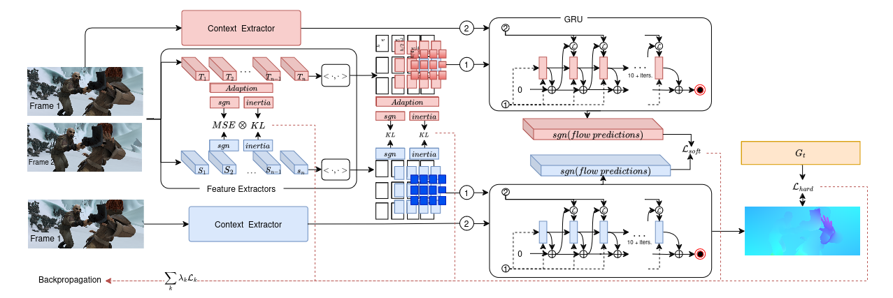

# DRAFT - Distilled Recurrent All-Pairs Field Transforms for Optical Flow

Conference paper: [View manuscript](10.1109/ICIP51287.2024.10648058).

Published in: 2024 IEEE International Conference on Image Processing (ICIP).




## Requirements
The code has been tested with PyTorch 3.7.16 and Cuda 11.6.
```Shell
conda create --name Draft
conda activate Draft
conda install pytorch=3.7.16 torchvision=1.13.1+cu117 cudatoolkit=11.6 matplotlib tensorboard scipy opencv -c pytorch
```

## Demos
Pretrained models can be downloaded using
```Shell
./get_models.sh
```
or downloaded from [google drive](https://drive.google.com/drive/folders/1akKiGueJXtsCg7lcViWoeRO7UHKf7Nra?usp=sharing)

You can demo a trained model on a sequence of frames
```Shell
python demo.py --model=models/Draft-things.pth --path=demo-frames --small
```

## Required Data
To evaluate/train DRAFT, following datasets are required: 
* [FlyingChairs](https://lmb.informatik.uni-freiburg.de/resources/datasets/FlyingChairs.en.html#flyingchairs)
* [FlyingThings3D](https://lmb.informatik.uni-freiburg.de/resources/datasets/SceneFlowDatasets.en.html)
* [Sintel](http://sintel.is.tue.mpg.de/)
* [KITTI](http://www.cvlibs.net/datasets/kitti/eval_scene_flow.php?benchmark=flow)
* [HD1K](http://hci-benchmark.iwr.uni-heidelberg.de/)


By default `datasets.py` will search for the datasets in these locations. You can create symbolic links to wherever the datasets were downloaded in the `datasets` folder

```Shell
├── datasets
    ├── Sintel
        ├── test
        ├── training
    ├── KITTI
        ├── testing
        ├── training
        ├── devkit
    ├── FlyingChairs_release
        ├── data
    ├── FlyingThings3D
        ├── frames_cleanpass
        ├── frames_finalpass
        ├── optical_flow
```

## Evaluation
You can evaluate a trained model using `evaluate.py`
```Shell
python evaluate.py --model=models/Draft-things.pth --dataset=sintel --mixed_precision --small
```

## Training
You can train the model using `trainKD.py`, where `model` describes the teacher model
```shell
python3 -u trainKD.py  --model models/raft-kitti.pth
```
